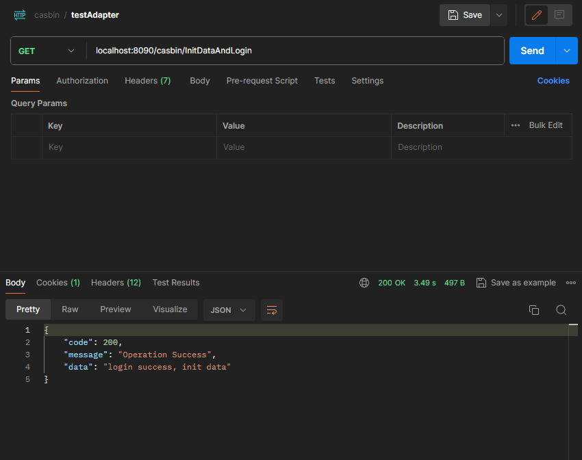

# using casbin in SpringSecurity

## inform
    To skip the tedious and complicated login process of Spring Security, 
    we're using its built-in login mode, which allows us to focus on the model authentication module.

## DataBase 
    For the database, we're using mysql. 
    Remember to create a casbin database if you don't have one, and configure it in the application.yml file.

## Simple Example
    check file examples.rbac.policy.csv you can find out we are using rbac model
    I registered with the identity of Alice who can read data1

    Than test the  result

